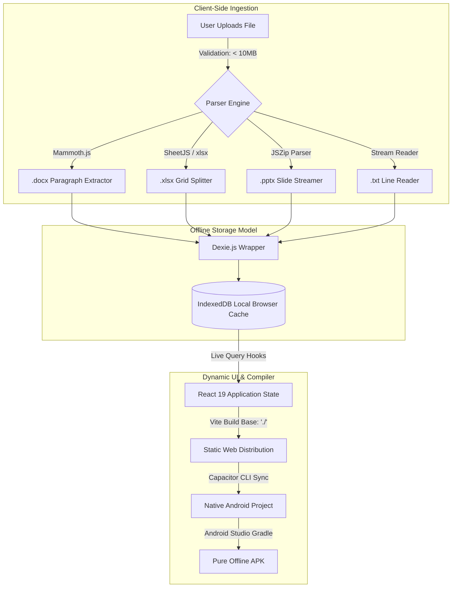

<div align="center">

# 📂 File-Processor (Cust Info)
### *A High-Performance, 100% Private Offline Document Ingestion & Editing Hub*

[](https://react.dev/)
[](https://vite.dev/)
[](https://tailwindcss.com/)
[](https://capacitorjs.com/)
[](https://dexie.org/)
[](https://opensource.org/licenses/MIT)

**Store, parse, edit, search, and export document streams entirely inside your browser. No cloud, no database servers, no data leaks. Just pure local-first performance.**

*This is a student project built to demonstrate local-first browser capabilities and compilation to a native offline Android APK container.*

</div>

---

## ✨ Key Features

*   🔒 **100% Private & Local-First:** Powered by **IndexedDB** via **Dexie.js**. Your files, client details, and modifications never leave your local device. Fully operational without an internet connection.
*   📦 **Multi-Format Ingestion Engine:**
    *   **Excel (`.xlsx`):** Splits sheets, columns, and rows into an interactive, high-performance data grid.
    *   **Word (`.docx`):** Parses complex documents down to individual editable paragraphs and headings.
    *   **PowerPoint (`.pptx`):** Seamlessly extracts text streams from slide-by-slide presentations.
    *   **Plain Text (`.txt`):** Reads and segments text files line-by-line for lightning-fast edits.
*   ✏️ **Granular In-Browser Editor:** Easily rename columns, update row cells, and modify document contents in real-time with automatic offline auto-saving.
*   🔍 **Instant Vector-Speed Search:** Query thousands of rows of local data instantaneously using high-speed client-side filtering.
*   🚀 **Capacitor Mobile Ready:** Specially optimized configuration for seamless compilation into an **Android APK** using Capacitor, converting it into a native, offline-first mobile app.
*   🎨 **Premium Aesthetic & Micro-Animations:** Built with **Tailwind CSS 4.0**, dynamic layouts, responsive sidebar architectures, and smooth transitions powered by **Framer Motion**.

---

## 🛠️ Tech Stack & Architecture



### Libraries Used:
- **Core:** [React 19](https://react.dev/) & [TypeScript](https://www.typescriptlang.org/) for type safety.
- **Styling:** [Tailwind CSS v4](https://tailwindcss.com/) & [Lucide React](https://lucide.dev/) for crisp vector iconography.
- **Animations:** [Framer Motion / Motion](https://motion.dev/) for micro-interactions and sliding drawers.
- **Storage:** [Dexie.js](https://dexie.org/) for highly-optimized client-side indexing.
- **Parsers:** [Mammoth.js](https://github.com/mikespook/mammoth.js) (Word), [SheetJS](https://sheetjs.com/) (Excel), [JSZip](https://stuk.github.io/jszip/) (Zip-based extraction for PPTX).
- **Mobile Container:** [Capacitor CLI & Core](https://capacitorjs.com/) for hybrid Android app compilation.

---

## 🚀 Quick Start Guide

### Prerequisites
Make sure you have [Node.js (v18+)](https://nodejs.org/) installed.

### 1. Clone & Install Dependencies
```bash
git clone https://github.com/Rishikesh324/File-Processor.git
cd File-Processor
npm install
```

### 2. Set Up Environment
Create a `.env.local` file in the root directory:
```env
# Optional: Setup Google AI / Gemini integrations if needed in the future
GEMINI_API_KEY=your_api_key_here
```

### 3. Run Web App Locally
```bash
npm run dev
```
Open your browser and navigate to `http://localhost:3000`.

---

## 📱 Compiling into an Android APK

Thanks to Capacitor, this repository can be fully compiled into a native Android app that runs 100% offline. Follow these steps to package and compile:

### Step 1: Add Android Native Platform
Install the Capacitor Android package and initialize the native project folder:
```bash
# Install native dependencies
npm install @capacitor/android

# Add the Android directory
npx cap add android
```

### Step 2: Compile & Sync Web Assets
Ensure Vite compiles your assets using relative paths (`base: './'` in `vite.config.ts` is already preconfigured to prevent blank screens in APKs).
```bash
# Build the production bundle
npm run build

# Sync compiled static files to the native Android directory
npx cap sync
```

### Step 3: Open in Android Studio
Launch Android Studio with the packaged Android workspace:
```bash
npx cap open android
```

### Step 4: Generate your APK in Android Studio
1. Wait for the **Gradle Sync** and index downloading to finish successfully.
2. In the top toolbar, go to **`Build`** $\rightarrow$ **`Build Bundle(s) / APK(s)`** $\rightarrow$ **`Build APK(s)`**.
3. Wait for the compilation log to output `BUILD SUCCESSFUL`.
4. Click the **Locate** notification on the bottom-right or navigate to:
   `android/app/build/outputs/apk/debug/app-debug.apk`
5. Transfer this `app-debug.apk` to your phone and install it to run the app fully native and offline!

---

## 📂 Project Structure

```text
File-Processor/
├── android/                   # Generated Android Native Project (Capacitor)
├── src/
│   ├── components/            # Interactive views (Upload, Search, Update grids)
│   ├── utils/
│   │   ├── parser.ts          # Mammoth, Zip, and SheetJS parse rules
│   │   └── dbHelpers.ts       # Indexing and database lifecycle logic
│   ├── App.tsx                # Main Router, sidebar shell, and export drawer
│   ├── db.ts                  # Dexie.js database schema definition
│   ├── index.css              # Global styles and custom Tailwind setups
│   └── types.ts               # Core document and record interfaces
├── capacitor.config.ts        # Capacitor App packaging config
├── vite.config.ts             # Vite bundler, base configurations, & HMR settings
├── package.json               # Scripts and dependency versions
└── README.md                  # Beautiful documentation (this file)
```

---

## 🛡️ License

This project is licensed under the MIT License - see the [LICENSE](LICENSE) file for details.
